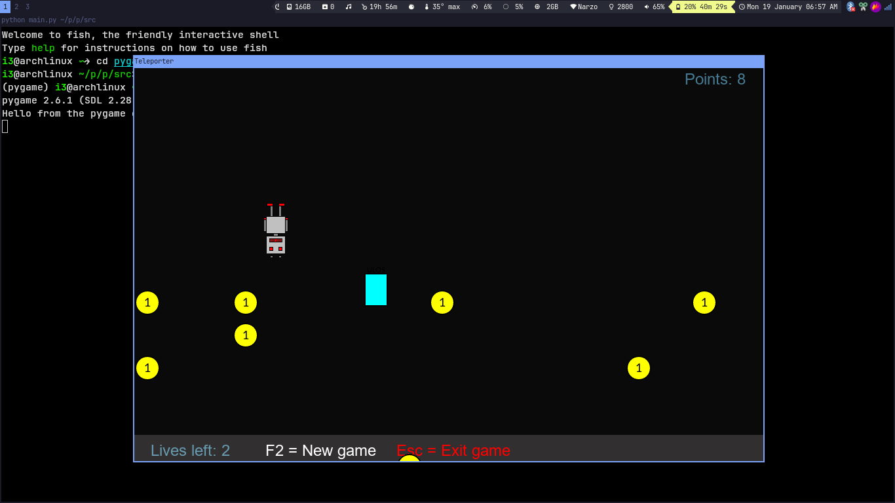

# Teleporter (pygame)

Small arcade dodger built with pygame where you collect coins, dodge monsters, and pass through a teleporter that inverts the controls and flips the world. The project was created as a final assignment for the University of Helsinki Python programming MOOC.

## What you do
- Move the robot with the arrow keys to grab coins and stack up points.
- Avoid monsters; each hit costs one of your three lives.
- Touching the teleporter reverses controls and flips coin and monster flow (inverted mode).
- Press `F2` to restart and `Esc` to quit.

## Prerequisites
- Python 3.11+ (any 3.10+ version that pygame supports should work)
- `pygame>=2.6`

## Setup and run
1) Create and activate a virtual environment (recommended).
2) Install the sole dependency:
	```bash
	pip install pygame
	```
3) From the repository root, change to `project/src` and run the game:
	```bash
    cd project/src/
	python main.py
	```

## Gameplay details
- Lives: 3; when they drop below zero, the game shows **Game Over**.
- Points: +1 per coin collected; speed scales with points (higher score = faster objects).
- Modes: normal mode has falling coins and left-moving monsters; inverted mode flips control mappings and reverses movement directions.
- New game: `F2` resets score, lives, and object positions.

## Controls
- `← → ↑ ↓` move the robot (direction reverses after using the teleporter)
- `F2` restart
- `Esc` quit

## Screenshots
- Normal mode: 
- Inverted mode: 

## Assets
Image assets (`coin.png`, `door.png`, `monster.png`, `robot.png`) are expected to live alongside `project/src/main.py`. If you add new art, keep dimensions consistent so collision and spacing feel natural.

## Development notes
- Code style: formatted with Ruff (configuration via default settings).
- Main loop entry point: [project/src/main.py](project/src/main.py) runs `Teleporter()` when executed directly.
- Helpful tweak points: adjust `step` in `move_robot()` for player speed, or change the `speed` calculation in `update()` to tune difficulty scaling.

## Other stuffs

I have also added code of minor excercises that I di while learning basics of pygame. All those directories are prefixed with *part13*.

## License
This project is distributed under the terms of the Unlicense; see [LICENSE](LICENSE).
